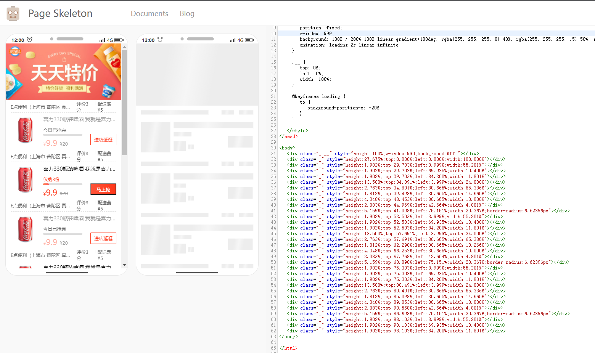

<p align="center">

</p>

<div align="center">
  <strong>:high_brightness:Automatically generate Skeleton Page:crescent_moon:</strong>
</div>

<div align="center">
  A <code>Webpack</code> plugin helps you build better JavaScript application
</div>

<hr />

<div align="center">
 <a href="https://nodei.co/npm/first-screen-skeleton-webpack-plugin/"></a>
</div>

<br />


### Features

fork自饿了么的[page-skeleton-webpack-plugin](https://github.com/ElemeFE/page-skeleton-webpack-plugin)项目，但做出如下改变：

- 除history路由外，支持hash路由
- 支持多入口页面
- 骨架屏生成算法调整，改用[京东dps](https://github.com/famanoder/dps),以优化体积
- 参数优化，精简参数

### Examples

All examples are in the `examples` folder.

* [**sale**](https://github.com/feiniao111/first-screen-skeleton-webpack-plugin/tree/master/examples/sale)

### Installation

Use `npm` to install this plugin, and you also need to install [html-webpack-plugin](https://github.com/jantimon/html-webpack-plugin).

> npm install --save-dev first-screen-skeleton-webpack-plugin
> 
> npm install --save-dev html-webpack-plugin

### Basic Use

**Step 1：configration**

After installing the plug-in according to the above tutorial, you need to configure the plugin so that the plugin can run normally. The plugin will perform different operations depending on the environment of the node. When `NODE_ENV === 'development'`, the plug-in can perform operations for generating and writing skeleton pages.

```javascript
const HtmlWebpackPlugin = require('html-webpack-plugin')
const { SkeletonPlugin } = require('first-screen-skeleton-webpack-plugin')
const path = require('path')
const webpackConfig = {
  entry: 'index.js',
  output: {
    path: __dirname + '/dist',
    filename: 'index.bundle.js'
  },
  plugin: [
    new HtmlWebpackPlugin({
       // Your HtmlWebpackPlugin config
    }),
    new SkeletonPlugin({
        pathname: path.resolve(__dirname, `${customPath}`), // the path to store shell file
        staticDir: path.resolve(__dirname, './dist'), // the same as the `output.path`
        routes: [{'index.html': ['/index']}], // Which routes you want to generate skeleton screen。支持多入口。如果是单入口页面，也可以这么传： routes: ['/', '/search']
    })
  ]
}
```

:notebook_with_decorative_cover:Since the plugin selects different operations based on the `process.env.NODE_ENV` environment variable, so you need to configurate environment variables in the `scripts` option in the `package.json` file as follows:

```json
"scripts": {
  "dev": "cross-env NODE_ENV=development node server.js",
  "build": "rm -rf dist && cross-env NODE_ENV=production webpack --progress --hide-modules"
}
```

That is, setting `NODE_ENV` to `development` in the development environment and `NODE_ENV` to `production` in the production environment.

#### Step 2：Modify template `index.html` of html-webpack-plugin

Add comment `<!-- shell -->` in the root element of you application.

```html
<!DOCTYPE html>
<html lang="en">
<head>
  <meta charset="UTF-8">
  <title>Document</title>
</head>
<body>
  <div id="app">
    <!-- shell -->
  </div>
</body>
</html>
```

#### Step 3：Operations and write shell

In the development page, use CtrlOrCmd + enter to call out the plugin interactive interface, or enter the `toggleBar` callout interface in the browser's JavaScript console.


Click the button in the interactive interface to preview the skeleton page. This process may take about 20s. After the plugin is ready for the skeleton page, it will automatically open the preview page through the browser, as shown below.



Scan the QR code in the preview page to preview the skeleton page on the mobile phone. You can directly edit the source code on the preview page. Write the skeleton page into the shell.html file by clicking the Write button in the upper right corner.

Re-package the application with webpack. When the page is restarted, you can see the application's skeleton structure before getting the data.

### Documents

**Server Options**

| Option    | Type            | Required? | Default      | Description                                                  |
| --------- | --------------- | --------- | ------------ | ------------------------------------------------------------ |
| pathname  | String          | Yes       | None         | Where the shell.html file shoud be output.                   |
| staticDir | String          | Yes       | None         | Path to output static route page                             |
| routes    | Array           | Yes       | None         | Route in `routes ` will generate static route with skeleton screen|
| Port      | String          | No        | 8989         | The port of Page Skeleton server                             |
| debug     | Boolean         | No        | `true`       | Whether debug mode is enabled or not, when debug is true, the output of the headless Chromium console will be output on the terminal. |
| logLevel  | String          | No        | `info`       | Which type of messages you want to print in terminal, the optional values are `info`, `warn` and default value is `info`. |
| quiet     | Boolean         | No        | `false`      | Whether to print messages on the terminal, when set to true, no messages are printed. |
| noInfo    | Boolean         | No        | `false`      | When the value is `true`, plugin will not print `info` message. |
| logTime   | Boolean         | No        | `true`       | Print formatted time before the message.                     |

**Skeleton Page Options**

| Option    | Type   | Required | Default      | Description                                                  |
| --------- | ------ | -------- | ------------ | ------------------------------------------------------------ |
| htmlOption| Object | No       | 具体见下面    | 控制骨架屏参数                                                |


**htmlOption Options**  
| Option    | Type   | Required | Default      | Description                                                  |
| --------- | ------ | -------- | ------------ | ------------------------------------------------------------ |
| background| String | No       | '180% / 200% 100% linear-gradient(100deg, rgba(255, 255, 255, 0) 40%, rgba(255, 255, 255, .5) 50%, rgba(255, 255, 255, 0) 60%) #ededed' | CSS 背景 |
| render    | Boolean| No       | false | 是否立即渲染到页面上 |
| animation | String | No       | 'loading 2s linear infinite' | CSS 动画 |
| animationStyles    | Array | No       | ['loading {to {background-position-x: -20%}}'] | CSS 动画style数组。数组元素会依次 添加到 @keyframes下 |
| init      | Function| No      | None         | 开始生成之前的操作                                  	          |
|includeElement(node, draw) | Function | No | None | 定制某个节点如何生成                                       |
| header.height | String | NO | None | 主题header的高 |
| header.background | String | NO | None | 主题header的背景色 |
| includeElement(node, draw) | Function | NO | None | 定制某个节点如何生成 |

**Puppeteer Options**

| Options | Type   | Required? | Default         | Description                                                  |
| ------- | ------ | --------- | --------------- | ------------------------------------------------------------ |
| device  | String | No        | `iPhone 6 Plus` | Used to set which mobile device simulator to generate the skeleton page. Refer to [puppeteer](https://github.com/GoogleChrome/puppeteer/blob/master/DeviceDescriptors.js) for configuration. |
| defer   | Number | No        | 5000            | Puppeteer starts the headless Chrome browser. The delay after opening the page is mainly to ensure that the page is fully loaded and the unit is `ms`. |
| cookie  | Array  | No        | `[]`            | Refer to [puppeteer](https://github.com/GoogleChrome/puppeteer/blob/master/DeviceDescriptors.js). |
| storagies | Object | No      | `{}`            | LocalStorage
| sessionStoragies | Object | No      | `{}`     | SessionStorage

**Default options**

```javascript
const pluginDefaultConfig = {
  port: '8989',
  device: 'iPhone 6 Plus',
  debug: false,
  defer: 5000,
  cookies: [],
  storagies: {},
  sessionStoragies: {},
  decimal: 4,
  logLevel: 'info',
  quiet: false,
  noInfo: false,
  logTime: true,
    htmlOption: { // 控制骨架屏参数
    background: '180% / 200% 100% linear-gradient(100deg, rgba(255, 255, 255, 0) 40%, rgba(255, 255, 255, .5) 50%, rgba(255, 255, 255, 0) 60%) #ededed',
    render: false, // 是否立即渲染到页面上
    animation: 'loading 2s linear infinite', // 动画
    animationStyles: ['loading {to {background-position-x: -20%}}']
  }
}
```

### Contribution

The project is under active development. If you have any questions, please submit your issues. Please refer to the issue template to submit the issue. If you are fixing a bug in the issues, please discuss it in the issue before submit the PR. If it is a new feature, submit a feature-related issue first before submit the PR.

There are three main development folders in the project:

- client: Used to communicate between development projects and plugin server.
- preview: The code of the preview page.
- src: plugin server code.
     - script: script to generate the skeleton page.

Special thanks to @Yasujizr who designed the banner of Page Skeleton.

**Maintainer**

jianshengou@163.com

### License

 [**MIT**](https://github.com/ElemeFE/page-skeleton-webpack-plugin/blob/master/LICENSE).


